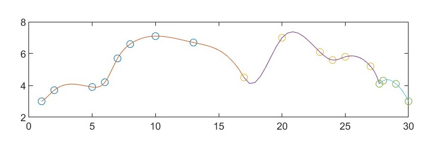
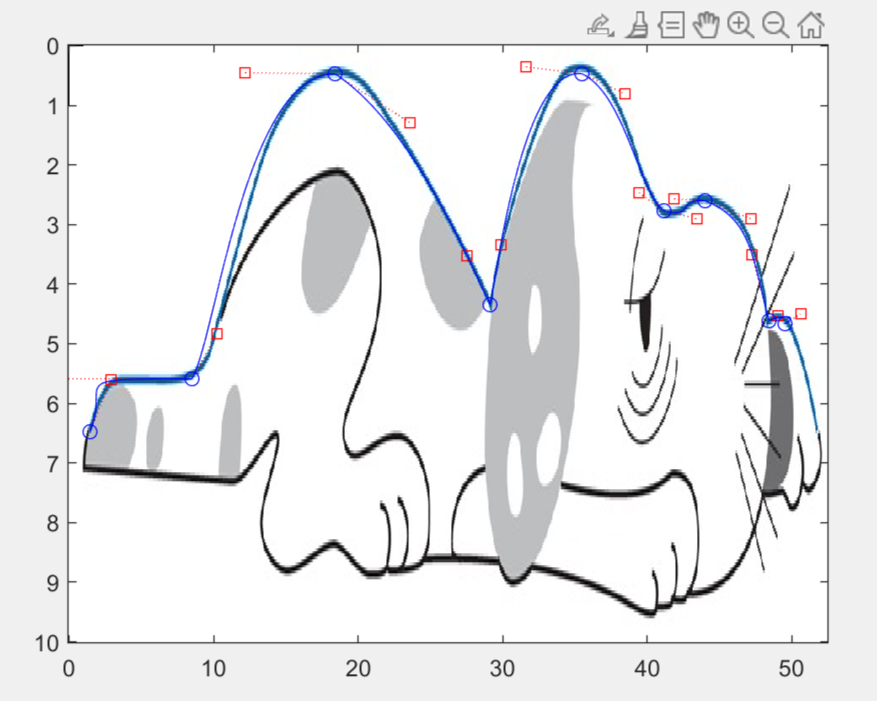

# Project 1: Spline

Author: WangHaoZhe (522072910008)  
Submit Date: 2023/4/30

## Main Code

**You can run this code section by section to test my each question.**

You can also find my full code (so you don't have to copy my programs from this pdf) and the raw file (in Markdown) of this pdf on my Github:
github.com/WangHaoZhe/Project1_Spline

```Matlab
% Project 1: Spline
% Author: WangHaoZhe 522072910008
% Create Date: 2023/3/18
% Submit Date: 2023/4/30

%% Question 1
% Curve 1
x1 = [1, 2, 5, 6, 7, 8, 10, 13, 17];
y1 = [3.0, 3.7, 3.9, 4.2, 5.7, 6.6, 7.1, 6.7, 4.5];
v11 = 1; v1n = -2/3;
% Curve 2
x2 = [17, 20, 23, 24, 25, 27, 27.7];
y2 = [4.5, 7.0, 6.1, 5.6, 5.8, 5.2, 4.1];
v21 = 3; v2n = -4;
% Curve 3
x3 = [27.7, 28, 29, 30];
y3 = [4.1, 4.3, 4.1, 3.0];
v31 = 1/3; v3n = -3/2;

% Plot spline curve
splineplot(x1,y1,v11,v1n);
splineplot(x2,y2,v21,v2n);
splineplot(x3,y3,v31,v3n);

%% Question 2
% Curve 1
coeff1 = splinecoeff(x1,y1,v11,v1n);
coeff2 = splinecoeff(x2,y2,v21,v2n);
coeff3 = splinecoeff(x3,y3,v31,v3n);

beziercurve(x1,y1,coeff1);
beziercurve(x2,y2,coeff2);
beziercurve(x3,y3,coeff3);

%% Question 3
img = imread('dog.jpg');
min_x = 0;
max_x = 52.5;
min_y = 0;
max_y = 10;
imagesc([min_x max_x], [min_y max_y], img); 
hold on;
[points,v1,vn] = bezierdraw;
x = [points(:,1)]';
y = [points(:,2)]';
pause(3);
splineplot(x,y,v1,vn);
```

## Question 1: Cubic Spline

### Code

#### File Name: splinecoeff.m

```Matlab
% Program 3.5 Calculation of spline coefficients
% Calculates coefficients of cubic spline
% Input: x,y vectors of data points
%   plus two optional extra data v1, vn
% Output: matrix of coefficients b1,c1,d1;b2,c2,d2;...
function coeff=splinecoeff(x,y,v1,vn)
n=length(x);
A=zeros(n,n);            % matrix A is nxn
r=zeros(n,1);
for i=1:n-1              % define the deltas
    dx(i) = x(i+1)-x(i); dy(i)=y(i+1)-y(i);
end
for i=2:n-1              % load the A matrix
    A(i,i-1:i+1)=[dx(i-1) 2*(dx(i-1)+dx(i)) dx(i)];
    r(i)=3*(dy(i)/dx(i) - dy(i-1)/dx(i-1)); % right-hand side
end

% Set endpoint conditions
% Use only one of following 5 pairs:
%A(1,1) = 1;              % natural spline conditions
%A(n,n) = 1;

A(1,1)=2;r(1)=v1;       % curvature-adj conditions
A(n,n)=2;r(n)=vn;

%A(1,1:2)=[2*dx(1) dx(1)];r(1)=3*(dy(1)/dx(1)-v1); % clamped
%A(n,n-1:n)=[dx(n-1) 2*dx(n-1)];r(n)=3*(vn-dy(n-1)/dx(n-1));

%A(1,1:2)=[1 -1];        % parabol-term conditions, for n>=3
%A(n,n-1:n)=[1 -1];

%A(1,1:3)=[dx(2) -(dx(1)+dx(2)) dx(1)]; % not-a-knot for n>=4
%A(n,n-2:n)=[dx(n-1) -(dx(n-2)+dx(n-1)) dx(n-2)];

coeff=zeros(n,3);
coeff(:,2)=A\r;          % solve for c coefficients
for i=1:n-1              % solve for b and d
    coeff(i,3)=(coeff(i+1,2)-coeff(i,2))/(3*dx(i));
    coeff(i,1)=dy(i)/dx(i)-dx(i)*(2*coeff(i,2)+coeff(i+1,2))/3;
end
coeff=coeff(1:n-1,1:3);
```

#### File Name: splineplot.m

```Matlab
% Plot cubic spline
% Input: x,y vectors of data points
% Output: a figure of spline curve
function [x1,y1]=splineplot(x,y,v1,vn)
n=length(x);
coeff=splinecoeff(x,y,v1,vn);
x1=[];y1=[];
for i=1:n-1
    xs=linspace(x(i),x(i+1),n+1);
    dx=xs-x(i);

    ys=coeff(i,3)*dx;
    ys=(ys+coeff(i,2)).*dx;
    ys=(ys+coeff(i,1)).*dx+y(i);

    x1=[x1;xs(1:n)'];
    y1=[y1;ys(1:n)'];
end
x1=[x1;x(end)];y1=[y1;y(end)];
plot(x,y,'o',x1,y1)
hold on;
```

### Result



## Question 2: Bezier Curve

### Code

#### File Name: beziercurve.m

```Matlab
% Plot Bezier curve
% Input: x,y vectors of data points, coefficient from cubic spline
% Output: a figure of Bezier curve
function beziercurve(x,y,coeff)
for i = 1:length(x)-1
    P0 = [x(i),y(i)];
    P1 = [x(i+1),y(i+1)];
    T0 = [1,coeff(i)];
    T1 = [1,coeff(i+1)];
    % Calculate Control Points: C0、C1、C2、C3
    x0 = P0(1);
    x1 = P1(1);
    y0 = P0(2);
    y1 = P1(2);
    dx0 = T0(1);
    dx1 = T1(1);
    dy0 = T0(2);
    dy1 = T1(2);
    C0 = [x0, y0];
    C3 = [x1, y1];
    C1 = C0 + [1/3*dx0, 1/3*dy0];
    C2 = C3 - [1/3*dx1, 1/3*dy1];

    % Plot Bezier Curve
    hold on;
    t = linspace(0,1,100);
    B = [0,0];
    for i=1:100
        B = [B;(1-t(1,i)).^3.*C0 + 3*(1-t(1,i)).^2.*t(1,i).*C1 + 3*(1-t(1,i)).*t(1,i).^2.*C2 + t(1,i).^3.*C3]; % 计算贝塞尔曲线上的点
    end
    plot(B(2:101,1), B(2:101,2));
    xlim([min(min(B)), max(max(B))]);
    ylim([min(min(B)), max(max(B))]);
end
hold on;
```

### Result


## Question 3: Freehand Draw

### Code

#### File Name: bezierdraw.m

```Matlab
%Program 3.7 Freehand Draw Program Using Bezier Splines
%Click in Matlab figure window to locate first point, and click 
%     three more times to specify 2 control points and the next 
%     spline point. Continue with groups of 3 points to add more
%     to the curve. Press return to terminate program.
function [points,v1,vn]=bezierdraw
plot([-1 1],[0,0],'k',[0 0],[-1 1],'k');hold on
t=0:.02:1;
[x,y]=ginput(1);            % get one mouse click
points=[x,y];
n=8;
for i=1:n
  [xnew,ynew] = ginput(3);  % get three mouse clicks
  if length(xnew) < 3
    break                   % if return pressed, terminate
  end
  x=[x;xnew];y=[y;ynew];    % plot spline points and control pts
  points=[points;x(4),y(4)];
  plot([x(1) x(2)],[y(1) y(2)],'r:',x(2),y(2),'rs');
  plot([x(3) x(4)],[y(3) y(4)],'r:',x(3),y(3),'rs');
  plot(x(1),y(1),'bo',x(4),y(4),'bo');
  bx=3*(x(2)-x(1)); by=3*(y(2)-y(1)); % spline equations ...
  cx=3*(x(3)-x(2))-bx;cy=3*(y(3)-y(2))-by;
  dx=x(4)-x(1)-bx-cx;dy=y(4)-y(1)-by-cy;
  xp=x(1)+t.*(bx+t.*(cx+t*dx));    % Horner's method
  yp=y(1)+t.*(by+t.*(cy+t*dy));
  plot(xp,yp,'b')             % plot spline curve
  x=x(4);y=y(4);            % promote last to first and repeat
  if(i==1)
      v1 = (by+2*cy+3*dy)/(bx+2*cx+3*dx);
  end
  if(i==n)
      vn = (by+2*cy+3*dy)/(bx+2*cx+3*dx);
  end
end
hold off
```

I modified the original program that was given in the assignment. This function can return the points and two slopes, so I was able to feed this data into the cubic spline function in question 1.

### Result

Freehand Draw:


Cubic spline based on the freehand draw data:


I forgot to scale the picture so that the dog seems much fatter XD.

But I think the result is right mathematically and it's a big work to draw that dog, so I still want to keep that fat dog and put it into my project report...
